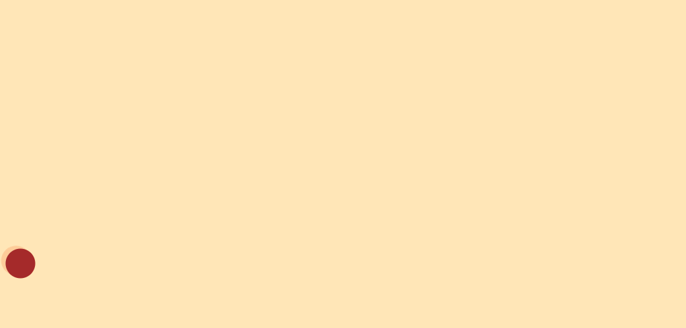
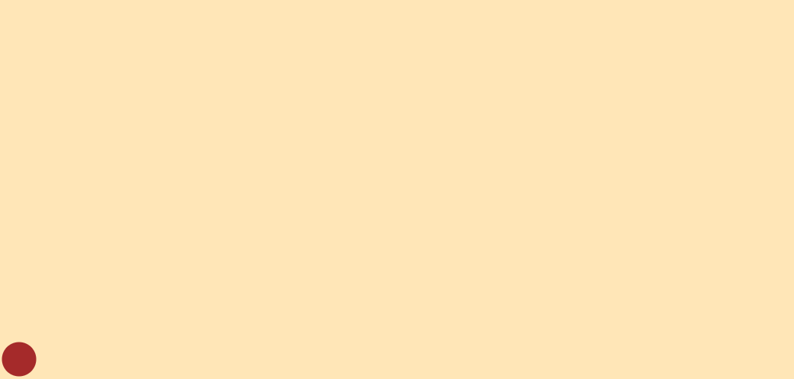
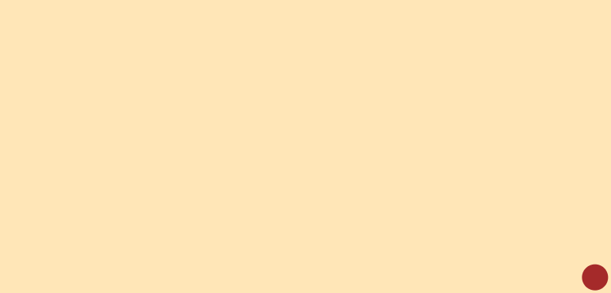

# Simple algorithms for displaying animations
This repository contains a simple set of functions to animate an object through a parent element, 
including based on a graph of a mathematic function or a SVG path.
## 💹 Animate an object based off a function with fn2Animation()
The function `fn2Animation()` permits creating smooth animations based of a mathematic function. It returns a returns a Web API [`Animation`](https://developer.mozilla.org/en-US/docs/Web/API/Animation) 
object, which can be played, reversed, played in a loop...
#### Parameters
* `element`: the object to animate (must be a child of an element that has a size)
* `fn`: the mathematical function that produces the animation graph
* `range`: an interval (`[a, b]`) specifying the range of the function graph to use.
* `fps`: the number of frames per second to display the animaton. *Remark: A number of 60fps is generally enough for perfectly smooth animations !*
* `duration`: the duration of the animation, in seconds.
* `options` (optional): an object that contains attributes to customize the result (see table below).

| Option | Description | Default | 
| :------: | :----------- | :-------: |
| `easing` | The easing function of the animation. | ``"linear"`` |
| `tracePath` | Whether to use the [`TraceEffect`](#path-tracing) or not. | ``false`` |
| `traceStyle` | [Drawing options](#tracing-options) for the TraceEffect. | `{stroke: orange, strokeWidth: "0.1px"}` |
| `enableTrail` | Whether to draw a [`TrailEffect`](#starry-trails) behind the followed element or not. | `true` |
| `trailStyle`| [Drawing options](#trail-options) for TrailEffect. | `{}` |

### Example
Let's make a beautiful animation with a beautiful curve: `f(x)=sin(2x)*cos(5x)`
```Javascript
import { fn2Animation } from "xd-motion"

const object = document.getElementById("animation-obj")

function animateObj() {
  const fx = x => Math.sin(2*x)*Math.cos(5*x)

  // Initialize the animation
  const anim = fn2Animation(object, fx,
    [-2, 2], 50, 5, {
      easing: "linear",
      tracePath: true,
      traceStyle: {
        stroke: "magenta",
        strokeOpacity: "0.5",
        strokeWidth: "0.25px",
        strokeDasharray: "2px 2px"
      },
      enableTrail: true,
      trailStyle: {
        maxLength: 50,
        decay: 0.08,
        opacityGradient: (p) => 1-p,
        lineWidthGradient: (p) => 50*(1 - p**(2/3)),
        hueGradient: (p) => 30 + + 40*p**3 + 120*p**2,
        lightnessGradient: (p) => 80,
        saturationGradient: (p) => 100
      }
    })

  anim.play()
}

```
**Result:** 



## ✨ Decorate animations with a variety of effects
### Path tracing 

The `TreceEffect` class permits tracing a path based off an array of points. It works by creating a [`polyline`](https://developer.mozilla.org/en-US/docs/Web/SVG/Reference/Element/polyline) behind the followed element. Its **z-index** is `-25` which can be overriden with a CSS rule since it has an `animation-trace` html class.

<a id="tracing-options"></a>
#### Parameters
* `container`: the parent element of the poly line. Must be the same as the followed element. 

* `options`: drawing options. The attributes are `stroke`, `strokeWidth`, `strokeDasharray`, `strokeDashoffset` and `strokeOpacity` (see [SVG presentation attributes](https://developer.mozilla.org/en-US/docs/Web/SVG/Reference/Attribute#presentation_attributes)).

#### Methods
* `addPoint()`: adds a point to the path. Triggering a redraw.

* `clearPoints()`: deletes all the points of the path.

* `startTracing()`: special method for tracing a specefic element, use it if you know all the points of the animation in advance. It returns a `stopTracing()` callback that you can execute at the end of the animation. 
    
    **Parameters**:
    * `animation`: the Web API animation object. (Used to sync the path and the animation)
    * `duration`: the duration of the animation.
    * `points`: the points that the element follows through the animation.
    * `easing`: the easing function. 
    *Warning: only linear, ease, ease-in, ease-out and ease-out-in are supported.*
    * `onRefresh` (optional): callback to execute at each `requestAnimationFrame()`.
    * `onFrame` (optional): callback to execute at each new frame of the animation.


### Starry trails

The `TrailEffect` class creates a fully customizable trail that can follow an element, somewhat like a traveling star. It works by creating a canvas that takes all the place of the parent of the followed element and drawing the trail on it. The **z-index** of this canvas is `-10`, which can be overriden with a CSS rule since it has an `animation-trail` html class.

#### Parameters
* `parent`: the parent of the trail. Must be the same as the parent of the followed element. 

* `followedElement` (optional): the element to follow.

* `options` (optional): an object containing drawing options, detailed in the table below:  
<a id="trail-options"></a>

| Attribute | Description | Default value |
| :-----: | :---------- | :-------: |
| `maxLength` | Maximum **number of points** on trail the higher it is, the longest the trail.| `30` |
| `decay` | **Rate** at which trail points **fade away** (Between 0 and 1). Each point has its opacity decremented by decay every time a new draw is triggered (via `addPoint()`).| `0.05` |
| `opacityGradient` | A **function** that takes as argument the **position** of a point in the trail (i.e his age, beetween 0 and 1) and returns the **opacity** value (0-1) of that point. |```(p) => Math.min(0.8, Math.pow(1 - p, 2) * 0.8)```|
| `lineWidthGradient` | Similar to `opacityGradient` but returns the **width** of the trail at each point. | **The width of the followed element** |
| `hueGradient` | Similar to `opacityGradient` but returns the **hue** value (0-360 degrees on color wheel) of the color at each point. |```(p) => 60 - p*95```|
| `saturationGradient` | Similar to `opacityGradient` but returns the **saturation** percentage (0-100) of the color at each point. |```(p) => 100```|
| `lightnessGradient` | Similar to `opacityGradient` but returns the **lightness** percentage (0-100) at each point. |```(p) => 60 + p*45```|
|`linecap`| The **shape** of each segment (point). It can be `"round"`, `"butt"` or `"square"`. | `"round"` |

#### Methods
* ``setMargin(value)``: To avoid having the trail go off the drawing canvas and get cut, an additional margin (in percentage of the parent) is applied. This method permits modifying it, which changes the dimensions of the canvas in the page. By default, the margin is 15%.

* ``getCanvasRect()``: Gets the effective dimensions of the canvas accounting for margin.

* ``addPoint(x, y)``: Adds a new point to the trail and triggers a redraw. Call it with [`requestAnimationFrame()`](https://developer.mozilla.org/en-US/docs/Web/API/Window/requestAnimationFrame) or every time you get a new position for your element. Though you can call it without arguments (which triggers a reflow), it is prefered to pass the x and y coordinates as arguments if available for performance reasons. If you call it without arguments and no `followedElement` was specified, it throws an Error.

* ``clear()``: clears the trail by deleting the drawing canvas from the DOM. 

